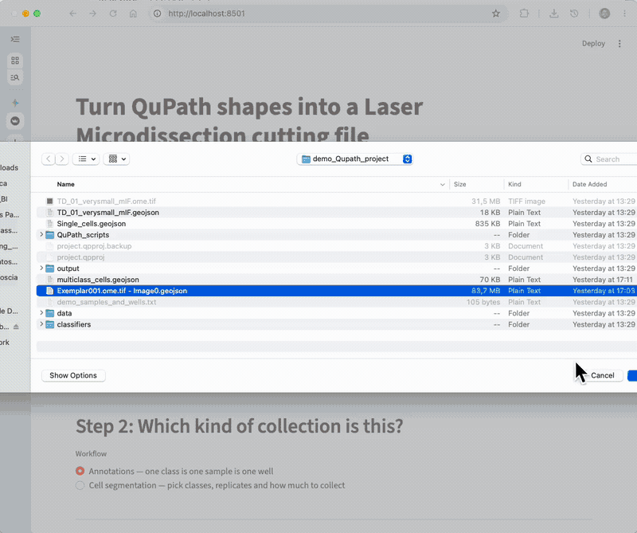

[](https://qupath-to-lmd-mdcberlin.streamlit.app/)

# Introduction

QuPath-to-LMD is the easiest way to go from QuPath annotations to LMD collection!
With more than 60 unique users, we try to help everyone collect their tissues for DVP.

Two workflows: **annotations**, the standard where every classified annotation is cut, and **cell segmentation**, where you ask for a number of cells or an area per replicate and the app picks the cells.

## In QuPath

0. Create a Qupath Project (optional)
1. Load images of interest
2. Draw annotations, or segment cells
3. Classify them using QuPath classes
4. Add at least 3 calibration points using the point tool, and **name each one**
5. Export as a **FeatureCollection** in the **.geojson** format
6. Load into webapp

## Streamlit webapp

Go to [Streamlit Webapp Link](https://qupath-to-lmd.streamlit.app/)

<a href="https://qupath-to-lmd-mdcberlin.streamlit.app/">
  
</a>

1. Upload your geojson file, and choose your calibration points
2. Choose a workflow: annotations or cell segmentation
3. Set up the plate
4. Process the files and download your output files

### Which workflow

**Annotations** — every classified annotation is cut, one class per well. Optionally split a
class into one shape per well for single-cell collection.

**Cell segmentation** — for files with thousands of classified cells. Choose your classes, then
set replicates and how much goes into each, either as a number of cells or as µm². The app
spreads the chosen cells across the tissue so a replicate is not one corner of the slide, can
avoid cells touching another cell you are collecting, and shows you exactly which cells were
picked before you export. Cells below a minimum area (100 µm² by default, per class) are left
out, so keeping only the shapes you can actually collect.

Both workflows let you set the smoothing tolerance and the cutting order, and both download the
same bundle: the `.xml` for the LMD, the plate scheme, a QC image, your processed `.geojson`,
and a log.

### The cell segmentation workflow, end to end


A real QuPath export of 14,145 shapes, 8,537 of them classified cells: choose the classes, set
replicates and amounts, lay out the plate, check which cells were picked, and download the `.xml`.

# Youtube Tutorials

## Introduction to Qupath-to-LMD Version4

[](https://youtu.be/K8xOIg6gNCY?si=g6YqzpwnHYZa69qo)

## Qupath-to-LMD v3 tutorial (somewhat old)

[](https://www.youtube.com/watch?v=jimBIqGUaXg&t=2s)

# Contributing

```
git clone https://github.com/CosciaLab/Qupath_to_LMD && cd Qupath_to_LMD
uv sync
uv run streamlit run streamlit_app.py
```

- Branch off `dev` and open the PR against `dev`.
- Before opening it: `uv run pytest`, `uv run ruff check src tests streamlit_app.py`, and
  `uv run python tools/golden_harness.py check`. The last one compares the exported `.xml` and
  `.csv` byte-for-byte against committed reference output — it is what catches a coordinate that
  moved by a pixel, which is invisible in the running app.
- Computation belongs in the library layer (`src/qupath_to_lmd/`, no Streamlit); anything that
  touches `st.*` belongs in a `ui_*` module.
- Adding a dependency means both `pyproject.toml` and
  `uv pip compile pyproject.toml -o requirements.txt` — the deployed app installs from
  `requirements.txt`.
- [`facts.md`](facts.md) records what is true about the app, [`decisions.md`](decisions.md) why it
  is that way, and [`GLOSSARY.md`](GLOSSARY.md) the vocabulary.

# Citation

Please cite the following work when using this package:

Please cite the [BioArxiv](https://www.biorxiv.org/content/10.1101/2025.07.13.662099v1):

Nimo, J., Fritzsche, S., Valdes, D. S., Trinh, M., Pentimalli, T., Schallenberg, S., Klauschen, F., Herse, F., Florian, S., Rajewsky, N., & Coscia, F. (2025). OpenDVP: An experimental and computational framework for community-empowered deep visual proteomics [Preprint]. bioRxiv. https://doi.org/10.1101/2025.07.13.662099

# FAQ

(0) What is the samples and well scheme?

It is the text, written in the format of a python dictionary, that allows the code to understand to which well will the countours be cut into. 

This is an example:

```python
{   
"Class_name_1" : "C3",  
"Class_name_2" : "C5",  
"Class_name_3" : "C7",  
}  
```

Each "Class_name_" is the exact name of the class of annotation found in Qupath.
The "C3", "C5", "C7" strings determine which well each class of shapes is collected into.
Works for both 384-well plates and 96-well plates

(1) I have a KeyError type of error, what do I do?

KeyError is usually because your samples_and_wells does not match your geojson file.
Check them, they have to be exactly the same.

(2) Not sure if your .geojson file is the correct format?

Check the example_input folder in the repository to see how they should look like.

(3) I have an error what do I do?

Create a gihtub issue explaning what are you doing and pasting the Traceback (the code that is trying to tell you what went wrong)

(4) I have different number of replicates per category of samples?

Either you create a set of classes that includes unnecessary classes and remove the ones you don't need from the samples and wells, or you create a set of classes that includes most samples, and then add the samples that have more replicates.

(5) Can I somehow set a threshold of how much area to annotate per class?

In the cell segmentation workflow, yes: set the per-replicate amount in µm² and the app collects
up to it, telling you if a class cannot supply what you asked for. For annotations it is still
manual — sum the area per class in QuPath's measurements, or limit the collection in the LMD7
software (>8).

(6) What if I want to collect various slides of tissue into the same 384wp

I suggest you create a set of QuPath classes that include all slides, make sure they are unique (Slide1_celltypeA_control_1). Then annotate as normal and export a .geojson file per slide. 
Then you should create a samples and wells scheme that includes all classes from all slides. Process each .geojson file with the same samples and wells scheme, and collect one slide at a time.

Alternatively, use **Start at well**: run the first slide, read the next free well from the
caption under the plate, and start the next slide there.

(7) How should I position my calibration points?

The closer the three calibration points are to the annotations the less distortion you are going to suffer.
Your tolerance for distortion depends on the size of your annotations (single cells will suffer greatly, mini-bulk less so).

For example:


In this image the small shapes at the top will likely suffer distortion, so the collection would be of different tissue than the one annotated for.

The solution is to separate into two sets of shapes, each with its own closer calibration points:


